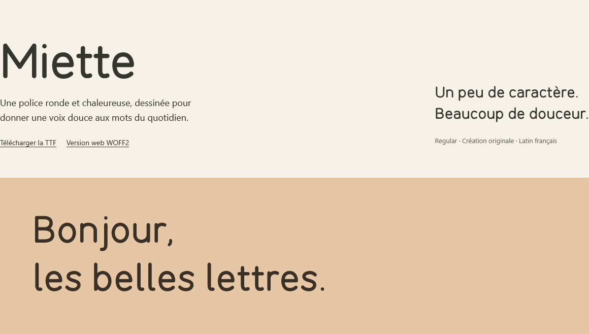

<div align="center">

# Font Design MCP

**Dessiner, inspecter, affiner et compiler des polices via MCP.**

Un serveur MCP local pour créer des polices avec un agent IA, du dessin vectoriel aux exports TTF et WOFF2.

[](https://github.com/Kydaix/font-design-mcp/actions/workflows/ci.yml)
[](pyproject.toml)
[](LICENSE)

[English](README.md) · **Français**

[Démarrer](#démarrer) · [Connecter un client](#connecter-un-client) · [Signaler un problème](https://github.com/Kydaix/font-design-mcp/issues)

</div>

---

## Démarrer

La version **0.6.0** ajoute les contrôles régionaux des traits, le diagnostic d'interpolation, les constructions
paramétrées persistantes et les preuves visuelles liées à une révision. Consultez les
[notes de version](docs/releases/v0.6.0.md) et le [guide de qualité et de livraison](docs/quality-release.fr.md).
L'installation se fait directement depuis GitHub, avec détection automatique des clients.
Avec **Node.js 20+ et Git**, lancez :

```sh
npx --yes github:Kydaix/Font-Design-MCP
```

L'installateur prépare uv et Python 3.13 si nécessaire, installe le MCP dans un environnement persistant,
détecte **Codex, Claude Code et Cursor**, puis demande lesquels configurer. Redémarrez les clients choisis.
Le MCP se configure dans l'application cliente et devient accessible à ses modèles compatibles.

```sh
npx --yes github:Kydaix/Font-Design-MCP --clients codex cursor
npx --yes github:Kydaix/Font-Design-MCP --yes
npx --yes github:Kydaix/Font-Design-MCP --clients codex --dry-run
```

`--yes` choisit tous les clients détectés ; `--clients` en sélectionne explicitement un ou plusieurs,
dont `claude-code`. `--workspace /chemin/absolu` choisit le dossier des polices. `--dry-run` prépare le
runtime mais affiche seulement les changements de configuration. Chaque fichier existant reçoit une
sauvegarde `.font-design-<id>.bak` avant remplacement atomique. Les autres serveurs et les réglages
existants du serveur sont conservés. Un fichier invalide est refusé. Relancer la commande met à jour
l'installation sans créer d'entrée en double.
Le workspace existant est conservé, sauf changement explicite via `--workspace` ou `FONT_DESIGN_MCP_WORKSPACE`.

Chaque installation crée un runtime séparé : un serveur actif ne bloque plus la mise à jour sous Windows.
Les anciens runtimes sont conservés pour les clients ouverts et les sauvegardes de configuration.
Le runtime installé reste utilisable après suppression du cache npm. Retirez son entrée MCP dans un client
pour le déconnecter. Les projets de polices restent
dans leur workspace. Le MCP est distribué via GitHub, sans publication sur PyPI ni npm. Les dépendances
Python restent téléchargées depuis leur index de paquets à la première installation.
Pour figer une version : `github:Kydaix/Font-Design-MCP#v0.6.0`.

Pour une configuration manuelle, `font-design-mcp config` imprime du JSON utilisant le wheel de la release
GitHub ; `config --from /chemin/absolu/paquet.whl` utilise un wheel téléchargé. Ces commandes ne modifient aucun client.

Priorité du workspace : `--workspace`, puis `FONT_DESIGN_MCP_WORKSPACE`, puis le dossier de données utilisateur :
`%LOCALAPPDATA%/font-design-mcp/workspace` sous Windows, `~/Library/Application Support/font-design-mcp/workspace`
sous macOS, `$XDG_DATA_HOME/font-design-mcp/workspace` (ou `~/.local/share/...`) sous Linux.
Ce dossier reste indépendant du cache UV et survit aux mises à jour et à la suppression de l’extension.

L’[extension MCPB](mcpb/manifest.json) vise les hôtes prenant en charge le runtime UV du manifeste 0.4.

### Développement depuis les sources

1. Clonez le dépôt et installez les dépendances avec les commandes ci-dessous.
2. Lancez le diagnostic et la démonstration pour générer votre premier spécimen.
3. [Connectez votre client MCP](#connecter-un-client) pour commencer à créer avec un agent.

**Prérequis :** Python 3.11–3.13, uv et un compte GitHub disposant de l'accès à ce dépôt.
Les commandes fonctionnent dans PowerShell et les shells POSIX.

```sh
git clone https://github.com/Kydaix/font-design-mcp.git
cd font-design-mcp
uv sync --frozen --python 3.11
uv run --frozen font-design-mcp doctor
uv run --frozen python examples/demo.py --workspace ./workspace
```

`doctor` vérifie les dépendances et rasterise un PNG ; `doctor --build` compile aussi TTF et WOFF2. Les opérations typographiques sont locales
après installation ; le serveur ne nécessite ni clé API de modèle ni éditeur propriétaire.
L'agent client peut utiliser un modèle distant.

La démonstration lance un vrai serveur STDIO avec le SDK Python MCP officiel. Elle dessine **A, V, O, Q, acute
et Á**, règle le crénage AV à −80 unités, déplace l'apex de A, compare les révisions, valide et compile les deux
formats d'export. Chaque exécution crée un nouveau projet et affiche le chemin de **`specimen.html`**.
Ouvrez ce fichier directement dans un navigateur.

| Sortie de la démonstration | Contenu |
|---|---|
| `specimen.html` | Aperçus en lecture seule et liens vers les polices générées ; aucun serveur web requis |
| `demo-calls.json` | Appels MCP et résultats structurés |
| `demo-report.json` | Références du projet, de la révision, des sources, des exports et de la validation |
| `revisions/` et `artifacts/` | Instantanés UFO, PNG, TTF/WOFF2, paramètres et hashes |

Les espaces de travail générés restent locaux et sont ignorés par Git.

## Miette : une police ronde en exemple

**Miette Regular** est une police originale, douce et arrondie, avec **84 lettres** : majuscules,
minuscules, accents français et æ/œ/Æ/Œ. La ponctuation et les espaces portent le total à 107 caractères
encodés. Ses dessins, composants accentués, réglages de crénage et recette de création MCP sont fournis.

[](examples/miette/README.md)

[Télécharger la TTF](examples/miette/Miette-Regular.ttf) · [Télécharger la WOFF2](examples/miette/Miette-Regular.woff2) · [Spécimen et reproduction](examples/miette/README.md)

Ouvrez `examples/miette/specimen.html` localement pour saisir votre texte, régler sa taille et comparer
le crénage. Cette première graisse Regular se concentre sur les lettres françaises ; les chiffres et
les autres styles ne sont pas inclus.

## Connecter un client

Le client MCP lance le processus serveur. Indiquez un **chemin absolu vers l'interpréteur** et un **chemin
absolu vers l'espace de travail** dans sa configuration :

```json
{
  "mcpServers": {
    "font-design": {
      "command": "/absolute/path/font-design-mcp/.venv/bin/python",
      "args": ["-m", "font_design_mcp", "serve", "--workspace", "/absolute/path/font-workspace"]
    }
  }
}
```

Sous Windows, utilisez `C:/path/font-design-mcp/.venv/Scripts/python.exe` pour `command` et un chemin absolu
Windows pour l'espace de travail. L'utilisateur fixe ce dossier au lancement ; aucun appel d'outil ne peut l'élargir.

<details>
<summary>Configuration Codex CLI</summary>

Ajoutez un bloc de ce type à votre configuration Codex, en adaptant les deux chemins :

```toml
[mcp_servers.font_design]
command = "/absolute/path/font-design-mcp/.venv/bin/python"
args = ["-m", "font_design_mcp", "serve", "--workspace", "/absolute/path/font-workspace"]
startup_timeout_sec = 20
tool_timeout_sec = 180
```

Ce format suit la [documentation MCP officielle de Codex](https://developers.openai.com/codex/mcp/).
Les chemins propres à l'installation de l'[exemple Windows](examples/codex.toml) doivent être adaptés.
Le client SDK est testé de bout en bout. Miette a aussi permis de vérifier une connexion MCP depuis Codex
sous Windows : création de projet, inspection, réception des aperçus et exports de police.

</details>

<details>
<summary>Lancer directement le serveur</summary>

Windows / PowerShell :

```powershell
.\.venv\Scripts\font-design-mcp.exe serve --workspace "$PWD\workspace"
```

macOS / Linux :

```sh
.venv/bin/font-design-mcp serve --workspace "$PWD/workspace"
```

Le processus attend les messages MCP sur stdin. Stdout est réservé à JSON-RPC : aucune bannière de démarrage
n'est affichée. Les logs vont vers stderr ou les journaux capturés du compilateur. L'exécutable installé évite
la résolution des dépendances au démarrage. En usage normal, laissez le client lancer le processus.

</details>

**L'accès aux images dépend du client.** Les outils de rendu retournent de véritables blocs image MCP, ainsi
que les chemins persistants, dimensions, hashes et révisions. Le client doit transmettre ces images à un
modèle capable de les exploiter.

## Créer une police

L'agent client prend les décisions créatives ; le serveur applique des opérations validées et conserve un historique des révisions.

| Étape | Ce que vous pouvez faire |
| --- | --- |
| **Dessiner** | Partir d'un brief et de quelques glyphes structurants. Créer segments, courbes cubiques et quadratiques, contreformes, composants et ancres. |
| **Prévisualiser et affiner** | Inspecter les PNG avec repères et poignées. Déplacer les points par identifiant stable et comparer les révisions aux mêmes tailles. |
| **Espacer et créner** | Stabiliser les proportions, régler les approches, puis le crénage. Tester des mots avec et sans crénage avant d'étendre l'alphabet. |
| **Valider et exporter** | Vérifier géométrie, couverture et compilation. Produire les TTF et WOFF2 depuis une révision figée. |

Conservez les hypothèses et corrections observées dans le journal de décisions du projet.

La version de développement ajoute des contrôles de contours par défaut, des profils d'épaisseur
perpendiculaires et des revues visuelles liées à une révision. `font_build` exporte une épreuve par défaut ;
`purpose="release"` exige un contrat de revue complet. Voir le [guide qualité et livraison](docs/quality-release.fr.md).

<details>
<summary>Exemple : déplacer un point et comparer les révisions</summary>

Chaque appel identifie son projet. Les éditions de sources exigent `expected_revision` ; les requêtes
périmées échouent au lieu d'écraser une autre modification. Les points et poignées ont des identifiants
stables : une correction peut donc se limiter à cette opération :

```json
{
  "op": "move_point",
  "point_id": "Aouter_1",
  "x": 340,
  "y": 720
}
```

Placez cette opération dans `glyph_edit.operations`, avec l'ID du projet, celui du glyphe et la révision
attendue courante. Une édition réussie renvoie la nouvelle révision et les IDs modifiés. `compare_revision`
sur l'un des outils de rendu affiche deux révisions dans les mêmes conditions d'observation.

</details>

La validation technique et l'appréciation de l'agent sont distinctes d'une approbation humaine. Le serveur
n'attribue pas de note artistique et n'accepte pas qu'un agent déclare une approbation humaine authentifiée.

## Travailler à partir de tes dessins

Importer des PNG calibrés avec `reference_import`, préserver leurs particularités et comparer les contours
reconstruits avec `render_glyph(reference_id=...)`. `design_spec` conserve la couverture et les cibles
mesurables ; `font_analyze` localise les écarts ; `render_proof` compare les lettres **et les chiffres**
à échelle commune. Les éditions préservant les poignées et les accents liés évitent certaines incohérences
lors des corrections locales.

Il s'agit d'une reconstruction contrôlée, **pas d'une vectorisation automatique ni d'une garantie de qualité
professionnelle**. Le [guide de travail à partir de dessins](docs/design-workflow.fr.md) détaille les exemples,
la calibration, les limites, le contrôle d'export facultatif et la compatibilité du schéma 3.

## Outils disponibles

Le SDK MCP officiel expose les schémas d'entrée et de sortie via `tools/list`. Les réponses contiennent des
données structurées, des résumés lisibles, les révisions, les avertissements et des erreurs identifiables.

| Outil | Fonction |
|---|---|
| `project_create` | Créer un projet avec métadonnées, métriques et brief facultatif |
| `project_open` | Rouvrir un projet créé par le serveur et vérifier son intégrité |
| `project_inspect` | Lire métadonnées, métriques, crénage et inventaire paginé des glyphes |
| `project_update` | Modifier le brief, les métadonnées prises en charge, les métriques verticales ou le journal |
| `glyph_get` | Inspecter contours, IDs, composants, ancres, avance, boîte et approches |
| `glyph_edit` | Appliquer un lot vectoriel typé et atomique à un glyphe |
| `font_edit` | Modifier jusqu'à 128 glyphes et leur espacement atomiquement dans une révision |
| `spacing_edit` | Régler avances, approches, paires et groupes de crénage |
| `render_glyph` | Rendre un glyphe avec repères, poignées et comparaison de révisions facultatifs |
| `render_text` | Compiler, composer et rendre un texte à plusieurs tailles |
| `reference_import` | Importer un PNG calibré depuis workspace/inbox comme référence immuable |
| `font_analyze` | Contrôler l'encre visible, les dessins identiques, les croisements, la portée des contrôles et les profils |
| `proof_review` | Enregistrer la revue de preuves immuables par l'agent et les choix intentionnels localisés |
| `font_release_check` | Identifier les mesures, revues de glyphes/textes et défauts non traités sur tous les masters |
| `render_proof` | Comparer plusieurs glyphes à échelle commune, y compris entre révisions |
| `font_validate` | Vérifier géométrie, couverture Unicode, compilation et tables OpenType |
| `font_build` | Exporter en TTF et/ou WOFF2 statique ou variable depuis une révision figée |
| `variable_configure` | Définir les axes continus et configurer les masters du projet |
| `history_list` | Consulter les révisions commises et résumés de changements |
| `history_restore` | Restaurer un état antérieur dans une nouvelle révision |

Les schémas exacts des entrées et sorties sont disponibles via l'appel MCP `tools/list`.

L'inspection, la lecture/édition de glyphes, les lots, la validation et les rendus utilisent
`detail="summary"` par défaut. Demandez `detail="full"` pour les données complètes, notamment les IDs
des points avant de les modifier ; `render_text` accepte aussi `detail="positions"`. Les images restent
incluses par défaut ; `image_mode="resource"` renvoie des références à récupérer via les ressources MCP.

## Sauvegarder et restaurer votre travail

UFO 3 est la source d'autorité des contours ; le contrat de dessin et les relations sont versionnés dans
le manifeste. Les binaires et les aperçus sont dérivés, mais **les références dessinées importées sont des
entrées du projet** : leurs artefacts doivent être conservés et sauvegardés avec l'ensemble du projet :

```text
workspace/<project_id>/
├── HEAD.json
├── revisions/<revision>/
│   ├── source.ufo/
│   └── manifest.json
└── artifacts/<artifact_id>/
    ├── font.ttf / font.woff2 / image.png
    └── artifact.json
```

Les éditions valident le projet entier, écrivent un nouvel instantané UFO complet, puis mettent à jour
atomiquement le pointeur de révision sous un verrou OS. Un lot invalide préserve l'état commis. Les hashes
détectent les changements externes ; une restauration conserve l'historique. Sauvegardez le dossier du
projet entier, de préférence serveur arrêté.

Utilisez un espace de travail local privé et modifiez les instantanés avec les outils. Le serveur contrôle
les chemins et références UFO, refuse les liens symboliques/jonctions et le XML dangereux, et n'expose aucun
outil de code arbitraire, terminal, téléchargement ou installation de paquet. Entrées, images, géométrie,
durée de compilation et logs sont bornés. Ces contrôles ne sont pas un sandbox OS contre un processus
hostile ayant les mêmes droits utilisateur, et les instantanés ne remplacent pas une sauvegarde externe.
Il n'y a ni quota disque global automatique ni purge de l'historique.

Les coordonnées sont en unités de police, ligne de base `y=0`, axe Y vers le haut. Avance, largeur visible
et approches sont des mesures différentes. UPM est fixé à la création. Les contours fermés utilisent le
remplissage non-zero ; les contreformes nécessitent une orientation opposée.

## Formats pris en charge et limites

**Périmètre actuel :** polices statiques et variables TTF/WOFF2, contours fermés libres, composants, ancres et crénage.
Le texte est composé par HarfBuzz depuis un TTF compilé et rasterisé avec FreeType/Pillow, sans substitution
par une police système.

Pour une police variable, `variable_configure` définit les axes et clone les masters dans le même projet.
Les outils d'édition acceptent `master_id`, `render_text` accepte `location: {"wght": 500}` et `font_build`
exporte automatiquement le fichier variable. Jusqu'à 4 axes continus et 8 masters, sous les limites de taille des sources.

**Non pris en charge dans cette version :** OTF, import UFO/SVG
arbitraire, traçage d'image, adaptateurs d'éditeurs, collaboration réseau et éditeur graphique complet.
Ni hinting ni code de fonctions OpenType arbitraire ne sont exposés. Les aperçus de texte sont des spécimens
sur une ligne, sans mise en page de paragraphes.

**Á précomposé avec des composants est testé.** Les marques combinantes latines avec ancres correspondantes
sont contrôlées : la fonction `mark` doit être accessible dans les TTF et WOFF2, y compris variables et en cache.
L'empilement des accents (`mkmk`) et les écritures complexes ne sont pas certifiés. La conversion de courbes peut
faire légèrement différer les aperçus de sources des contours compilés ; le rendu FreeType non hinté
ne garantit pas une identité avec le rendu natif du système.

## Compiler depuis les sources

Après les étapes de [démarrage](#démarrer), générez l'archive source et le wheel :

```sh
uv build
```

Sortie : `dist/`. Les versions des dépendances sont fixées dans `pyproject.toml` et `uv.lock` ;
`requirements.lock` fournit les dépendances avec hashes pour pip :
`pip install --require-hashes -r requirements.lock`, puis `pip install --no-deps /chemin/vers/paquet.whl`.

### Vérifications

```sh
uv run --frozen pytest -q
uv run --frozen ruff check src tests scripts examples
uv run --frozen python tests/test_acceptance.py
```

Le client d'acceptation autonome conserve ses captures et sa transcription JSON-RPC dans
`test-output/acceptance-*`. Il vérifie le crénage compilé, l'isolation des éditions, les conflits de révision,
les lots invalides atomiques, les chemins dangereux, l'échec du compilateur, le redémarrage et les écritures
interrompues.

| Vérification | Résultat |
| --- | --- |
| **Windows 11 x64, Python 3.11** | 53 tests locaux réussis, dont installation des clients, interpolation variable, appels STDIO réels, éditions atomiques, rendu et récupération |
| **Runners Windows, macOS et Linux** | [Résultats CI](https://github.com/Kydaix/font-design-mcp/actions/workflows/ci.yml), avec Python 3.11 et 3.13 |
| **Wheel installé** | Commande d'entrée et démonstration MCP complète testées dans un environnement séparé |
| **Extension MCPB** | Installée hors dépôt ; diagnostic, appels STDIO et exports TTF/WOFF2 testés |

Le résultat CI couvre les environnements de ses runners, pas toutes les versions d'OS ou architectures CPU.

## Crédits et licence

Construit avec le SDK Python MCP officiel, les sources UFO, HarfBuzz et FreeType/Pillow.
Les mentions des bibliothèques tierces sont incluses dans les paquets de dépendances installés.

Le code du serveur et les exemples originaux sont sous [licence MIT](LICENSE). **Cette licence ne s'applique
pas automatiquement aux polices que vous créez avec le serveur.** Les métadonnées de licence des polices
sont vides par défaut et restent sous le contrôle du créateur. Aucun contour ni fichier de police tiers n'est inclus.
